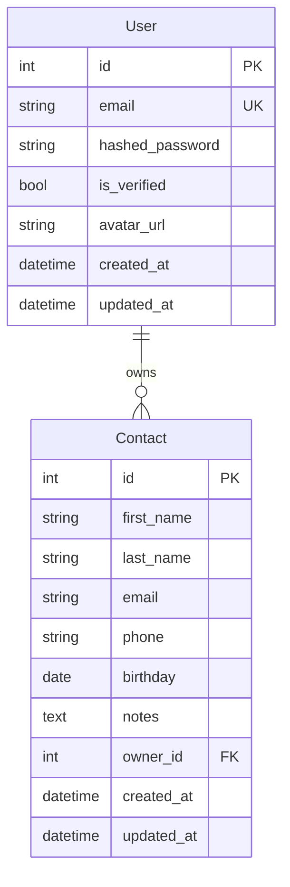
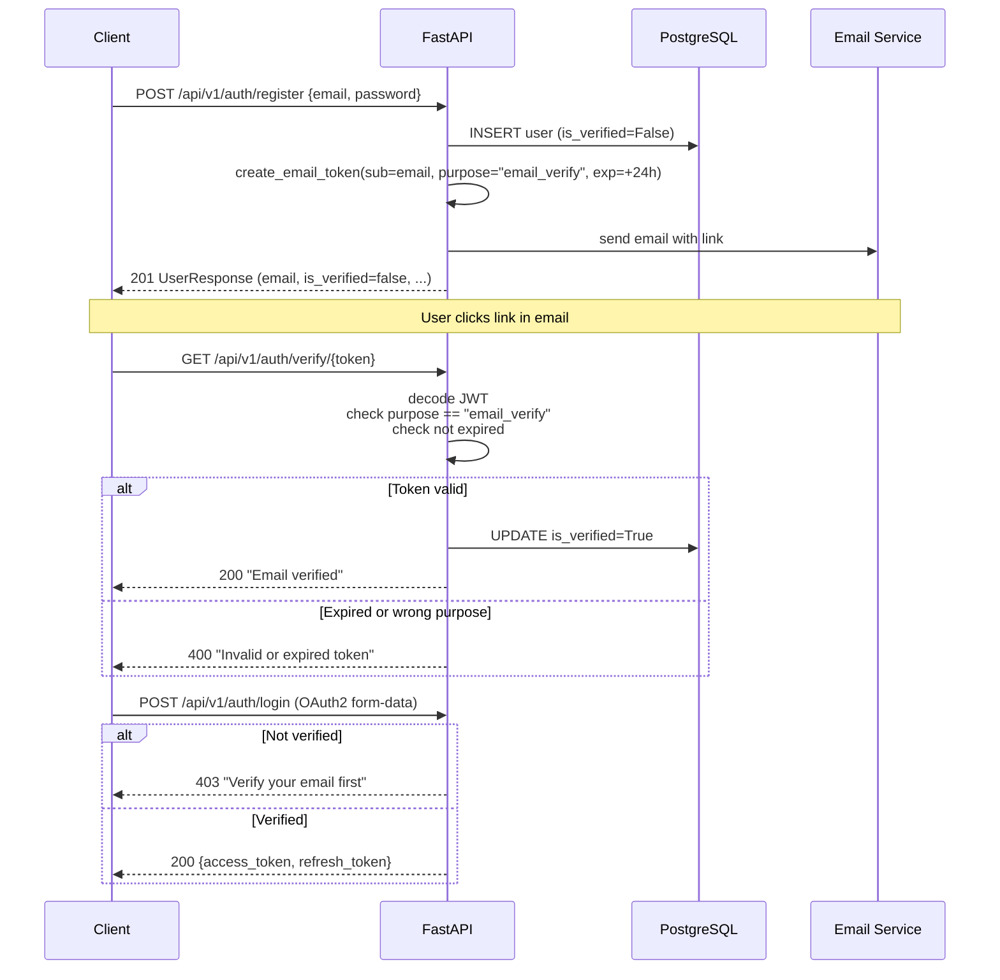
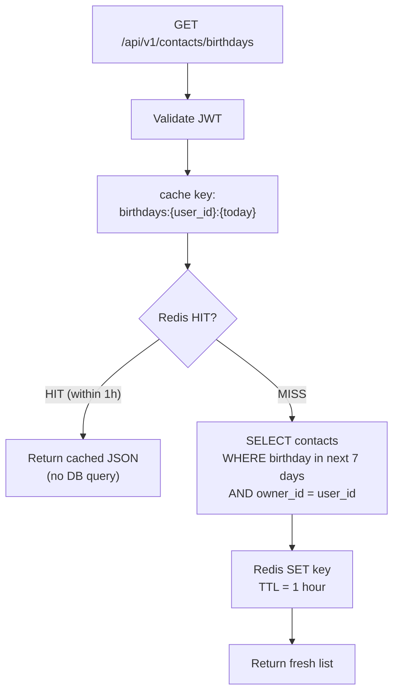

# Architecture — Contacts API

## System Overview

```mermaid
graph TB
    Client["Client\n(Browser / curl / Postman)"]

    subgraph Docker Compose — Development
        API["FastAPI app\n:8000"]
        PG[("PostgreSQL 16\ncontacts_db")]
        Redis[("Redis 7\ncache + rate limits")]
        MailHog["MailHog\n:8025 web UI\n:1025 SMTP"]
    end

    Cloudinary["Cloudinary CDN\navatar storage"]
    Gmail["Gmail SMTP\nproduction email"]
    Render["Render.com\nproduction host"]
    GH["GitHub Actions\nCI/CD"]

    Client -->|"REST + JSON"| API
    API -->|"SQLAlchemy async"| PG
    API -->|"redis-py async"| Redis
    API -->|"FastAPI-Mail\n(dev)"| MailHog
    API -->|"cloudinary SDK"| Cloudinary
    MailHog -.->|"prod: replaced by"| Gmail
    GH -->|"tests pass → auto-deploy"| Render
```

## Application Structure

```
app/
├── main.py          ← app factory, routers, CORS, rate limit error handler
├── config.py        ← Settings(BaseSettings) — all env vars in one place
├── database.py      ← async engine, AsyncSession, get_db dependency
│
├── models/          ← SQLAlchemy ORM models (tables)
│   ├── user.py      ← User: email, password_hash, is_verified, avatar_url
│   └── contact.py   ← Contact: names, phone, email, birthday, owner FK
│
├── schemas/         ← Pydantic models (request/response validation)
│   ├── user.py
│   ├── contact.py
│   └── token.py
│
├── core/            ← cross-cutting concerns
│   ├── security.py      ← JWT: access token, refresh token, email token
│   ├── dependencies.py  ← get_current_user, require_verified
│   ├── rate_limit.py    ← SlowAPI limiter
│   └── cache.py         ← Redis get_or_set helper
│
├── services/        ← business logic (no HTTP, no DB sessions — pure functions + db calls)
│   ├── auth.py          ← get_user_by_email, create_user
│   ├── contacts.py      ← CRUD + birthday query
│   ├── email.py         ← send_verification_email
│   └── cloudinary_service.py ← upload_avatar
│
└── api/v1/          ← HTTP endpoints (thin layer: validate → call service → return)
    ├── auth.py
    ├── contacts.py
    └── users.py
```

## Data Model



## Email Verification Flow



## Birthday Caching Flow



**Why include today's date in the cache key?**
Because `birthdays:{user_id}` would return stale data across midnight. `birthdays:{user_id}:{2025-01-24}` automatically becomes a cache miss at midnight when the date changes.

## Rate Limiting

```
POST /api/v1/auth/register  → 5 requests/minute per IP
POST /api/v1/auth/login     → 10 requests/minute per IP

429 Too Many Requests response on violation.
Rate limit counters stored in Redis — works across multiple app instances.
```

## JWT Token Types

Three token types, all signed with Jose (same library as Module 12):

| Token | Secret | Payload | TTL |
|-------|--------|---------|-----|
| Access | `JWT_SECRET_KEY` | `{sub: email, purpose: "access"}` | 30 min |
| Refresh | `JWT_REFRESH_SECRET` | `{sub: email, purpose: "refresh"}` | 7 days |
| Email | `EMAIL_TOKEN_SECRET` | `{sub: email, purpose: "email_verify"}` | 24h |

The `purpose` claim on email tokens prevents an access token from being used as a verification token even if intercepted.

## Services: Why Direct SQLAlchemy (No Repository Pattern)

Services call SQLAlchemy's `AsyncSession` directly. There is no `ContactRepository` class wrapping the queries.

A repository pattern adds a useful abstraction when:
- You need to swap the data source (e.g., DB → in-memory for tests)
- Multiple services need the same complex query

In this app, tests use `dependency_overrides` to swap the DB session (SQLite instead of PostgreSQL), which achieves data source isolation without a repository class. Adding a repository layer here would be an abstraction looking for a problem to solve.

## What's in Redis

| Key pattern | Value | TTL | Purpose |
|-------------|-------|-----|---------|
| `birthdays:{user_id}:{date}` | JSON list | 1h | Birthday query cache |
| `slowapi:{ip}:{endpoint}` | request count | 1min | Rate limiting |
| `blacklist:{refresh_token}` | 1 | token expiry | Logout invalidation |
